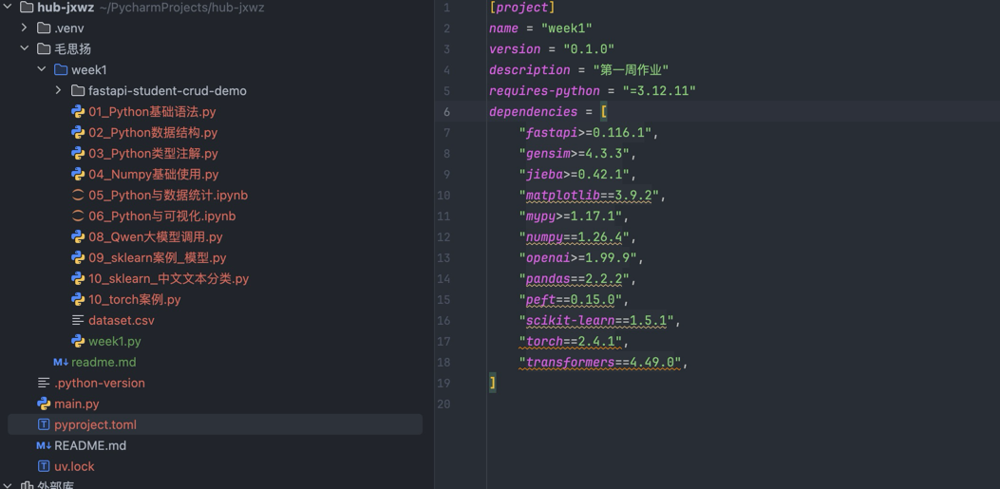

# 1.第一周

 1、配置好python环境，包括常见的jieba、sklearn、pytorch等

​		

 2、使用 dataset.csv数据集完成文本分类操作，需要尝试2种不同的模型。（注意：这个作业代码实操提交）

​		详见week1.py

# 2.第二周

1、调整 09_深度学习文本分类.py 代码中模型的层数和节点个数，对比模型的loss变化

​		详见week2_1.py

 2、调整 06_torch线性回归.py 构建一个sin函数，然后通过多层网络拟合sin函数，并进行可视化。

​		详见week2_2.py

# 3.第三周
1、 理解rnn、lstm、gru的计算过程（面试用途），阅读官方文档 ：https://docs.pytorch.org/docs/2.4/nn.html#recurrent-layers 
最终 使用 GRU 代替 LSTM 实现05_LSTM文本分类.py

​		详见week3.py

2、阅读项目计划书  + 初步项目代码，写清楚四个模型的优缺点，形成一个word/markdown提交。

​		详见week3.md
